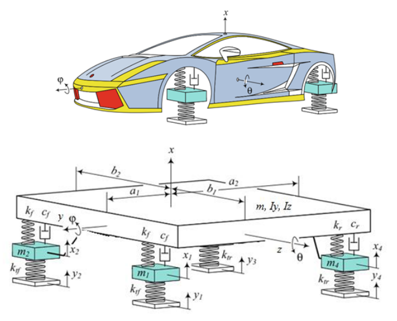

# Car Vibration Model

This repository contains MATLAB code for simulating the dynamic response of a car model to road-induced vibrations. The model considers a combination of translational and rotational dynamics, as well as the effects of suspension and road profile influences.

---

## Overview

This code simulates car vibrations with the following parameters:

- **Mass and Inertia**: Includes total car mass, individual wheel masses, and moments of inertia for yaw and pitch rotations.
- **Suspension System**: Stiffness and damping coefficients for the front and rear suspensions.
- **Tire and Road**: Tire stiffness and road profile effects.

---

## Key Features

- Simulation of road-induced vibrations for a four-wheel car model.
- Time-domain solutions for body and wheel displacements and rotations.
- Visualization of dynamic responses for various scenarios.

---

## File Structure

- **Main MATLAB File**: Contains the implementation of the car vibration model. Includes multiple simulations for different road profiles.
- **Output Plots**: Automatically generated plots to illustrate the car's dynamic response.

---

## How to Run

1. Open the `.m` file in MATLAB.
2. Define input parameters for road profile and car properties at the beginning of the script.
3. Run the script to generate plots for vibration simulations.

---

## Simulation Scenarios

The script includes two main scenarios:

1. **Sinusoidal Road Profile for Front Axle**: Simulates vibration due to a sinusoidal road profile with specified amplitude and wavelength.
2. **Front-Left Wheel Excitation**: Simulates vibration from a different sinusoidal profile affecting only the front-left wheel.

---

## Parameters

You can modify the following parameters in the script:

- **Mass and Inertia**:
  - `m`: Total mass of the car.
  - `mf`, `mr`: Front and rear wheel masses.
  - `Iy`, `Iz`: Moments of inertia.

- **Stiffness and Damping**:
  - `kf`, `kr`: Suspension stiffness (front and rear).
  - `cf`, `cr`: Damping coefficients (front and rear).
  - `ktf`, `ktr`: Tire stiffness.

- **Road Profile**:
  - `A1`, `A2`: Amplitudes of sinusoidal road profiles.
  - `lambda`: Wavelength of the road-induced vibration.

---

## Output

The script generates the following plots:

- **Body Displacement and Rotation**: \( x(t), \phi(t), \theta(t) \)
- **Wheel Displacements**: \( x_1(t), x_2(t), x_3(t), x_4(t) \)
- **Road Excitation Profiles**: \( y_1(t), y_2(t), y_3(t), y_4(t) \)

---

## Author

- **Name**: Davi Lima Mendes dos Santos  
- **University**: Universidade Federal de Santa Maria  
- **Course**: Dinâmica de Estruturas e Aeroelasticidade    
